# Database Models Reference

> **Database:** PostgreSQL 16 (Docker)
>
> **ORM:** SQLAlchemy with async support (`asyncpg` driver)
>
> **Primary Keys:** UUID v4 across all tables
>
> **Version:** 1.0 &mdash; Urban Home School (The Bird AI)

---

## Table of Contents

1. [users](#1-users)
2. [students](#2-students)
3. [ai_tutors](#3-ai_tutors)
4. [ai_providers](#4-ai_providers)
5. [ai_agent_profiles](#5-ai_agent_profiles)
6. [courses](#6-courses)
7. [enrollments](#7-enrollments)
8. [assessments](#8-assessments)
9. [assessment_submissions](#9-assessment_submissions)
10. [transactions](#10-transactions)
11. [wallets](#11-wallets)
12. [payment_methods](#12-payment_methods)
13. [forum_posts](#13-forum_posts)
14. [forum_replies](#14-forum_replies)
15. [forum_likes](#15-forum_likes)
16. [certificates](#16-certificates)
17. [notifications](#17-notifications)
18. [categories](#18-categories)
19. [contact_messages](#19-contact_messages)
20. [instructor_applications](#20-instructor_applications)
21. [products](#21-products)
22. [product_categories](#22-product_categories)
23. [carts](#23-carts)
24. [cart_items](#24-cart_items)
25. [orders](#25-orders)
26. [order_items](#26-order_items)
27. [shipping_addresses](#27-shipping_addresses)
28. [subscriptions](#28-subscriptions)
29. [revenue_metrics](#29-revenue_metrics)
30. [payment_analytics](#30-payment_analytics)
31. [ER Diagram](#er-diagram)

---

## Common Patterns

All models in the Urban Home School database follow these conventions:

- **UUID Primary Keys:** All tables use UUID v4 primary keys generated by `uuid.uuid4()`.
- **Timestamps:** Most tables include `created_at` and `updated_at` columns with UTC timestamps.
- **Soft Deletes:** Key tables use `is_deleted` (boolean) and `deleted_at` (nullable datetime) instead of hard deletes.
- **JSONB Flexibility:** Flexible data is stored in PostgreSQL JSONB columns for schema-less extensibility.
- **Indexed Columns:** Frequently queried columns are indexed for performance.

---

## 1. users

The central authentication and identity table. Supports six user roles with flexible profile storage.

**Table:** `users`
**Model:** `app.models.user.User`

| Column | Type | Nullable | Default | Constraints | Index | Description |
|--------|------|----------|---------|-------------|-------|-------------|
| `id` | UUID | No | `uuid4()` | PRIMARY KEY | Yes | Unique user identifier. |
| `email` | VARCHAR(255) | No | - | UNIQUE | Yes | User email address for login. |
| `password_hash` | VARCHAR(255) | No | - | - | No | Bcrypt password hash. |
| `role` | VARCHAR(50) | No | - | - | Yes | User role: `student`, `parent`, `instructor`, `admin`, `partner`, `staff`. |
| `is_active` | BOOLEAN | No | `true` | - | No | Whether the account is active. |
| `is_deleted` | BOOLEAN | No | `false` | - | Yes | Soft delete flag. |
| `is_verified` | BOOLEAN | No | `false` | - | No | Email verification status. |
| `profile_data` | JSONB | No | `{}` | - | No | Role-specific profile fields (name, phone, bio, etc.). |
| `created_at` | TIMESTAMP | No | `utcnow()` | - | Yes | Account creation time. |
| `updated_at` | TIMESTAMP | No | `utcnow()` | ON UPDATE | No | Last modification time. |
| `last_login` | TIMESTAMP | Yes | `null` | - | No | Most recent login timestamp. |
| `deleted_at` | TIMESTAMP | Yes | `null` | - | No | Soft deletion timestamp. |

**Relationships:**
- `subscriptions` -> `Subscription` (one-to-many, cascade delete-orphan)
- `transactions` -> `Transaction` (one-to-many, cascade delete-orphan)
- `payment_methods` -> `PaymentMethod` (one-to-many, cascade delete-orphan)
- `wallet` -> `Wallet` (one-to-one, cascade delete-orphan)
- `instructor_profile` -> `InstructorProfile` (one-to-one, cascade delete-orphan)
- `partner_profile` -> `PartnerProfile` (one-to-one, cascade delete-orphan)
- `ai_agent_profile` -> `AIAgentProfile` (one-to-one, backref)

---

## 2. students

Student profiles linked to user accounts and parent guardians.

**Table:** `students`
**Model:** `app.models.student.Student`

| Column | Type | Nullable | Default | Constraints | Index | Description |
|--------|------|----------|---------|-------------|-------|-------------|
| `id` | UUID | No | `uuid4()` | PRIMARY KEY | Yes | Student identifier. |
| `user_id` | UUID | No | - | FK `users.id` ON DELETE CASCADE, UNIQUE | Yes | Link to student's user account. |
| `parent_id` | UUID | Yes | `null` | FK `users.id` ON DELETE SET NULL | Yes | Link to parent/guardian account. |
| `admission_number` | VARCHAR(50) | No | - | UNIQUE | Yes | Unique admission/registration number. |
| `grade_level` | VARCHAR(20) | No | - | - | Yes | Current grade (e.g., `Grade 7`, `ECD 1`). |
| `enrollment_date` | DATE | No | - | - | Yes | Platform enrollment date. |
| `is_active` | BOOLEAN | No | `true` | - | No | Active status. |
| `learning_profile` | JSONB | No | `{}` | - | No | Learning style, strengths, weaknesses, interests, goals, special needs. |
| `competencies` | JSONB | No | `{}` | - | No | CBC competency progress tracking. |
| `overall_performance` | JSONB | No | `{}` | - | No | Grades and assessment results. |
| `created_at` | TIMESTAMP | No | `utcnow()` | - | Yes | Record creation time. |
| `updated_at` | TIMESTAMP | No | `utcnow()` | ON UPDATE | No | Last modification time. |

**Relationships:**
- `mood_entries` -> `StudentMoodEntry` (one-to-many)
- `streak` -> `StudentStreak` (one-to-one)
- `daily_plans` -> `StudentDailyPlan` (one-to-many)
- `journal_entries` -> `StudentJournalEntry` (one-to-many)
- `wishlists` -> `StudentWishlist` (one-to-many)
- `session_preps` -> `StudentSessionPrep` (one-to-many)
- `xp_events` -> `StudentXPEvent` (one-to-many)
- `level` -> `StudentLevel` (one-to-one)
- `badges` -> `StudentBadge` (one-to-many)
- `goals` -> `StudentGoal` (one-to-many)
- `skill_nodes` -> `StudentSkillNode` (one-to-many)
- `weekly_reports` -> `StudentWeeklyReport` (one-to-many)

---

## 3. ai_tutors

Dedicated AI tutor instances assigned to individual students.

**Table:** `ai_tutors`
**Model:** `app.models.ai_tutor.AITutor`

| Column | Type | Nullable | Default | Constraints | Index | Description |
|--------|------|----------|---------|-------------|-------|-------------|
| `id` | UUID | No | `uuid4()` | PRIMARY KEY | Yes | Tutor identifier. |
| `student_id` | UUID | No | - | FK `students.id` ON DELETE CASCADE, UNIQUE | Yes | One-to-one link to student. |
| `name` | VARCHAR(100) | No | - | - | No | Personalized tutor name (e.g., "Birdy", "Einstein"). |
| `conversation_history` | JSONB | No | `[]` | - | No | Array of `{role, content, timestamp}` messages. |
| `learning_path` | JSONB | No | `{}` | - | No | Personalized curriculum path. |
| `performance_metrics` | JSONB | No | `{}` | - | No | Student strengths, weaknesses, progress. |
| `response_mode` | VARCHAR(20) | No | `'text'` | - | Yes | Response mode: `text`, `voice`, `video`. |
| `total_interactions` | INTEGER | No | `0` | - | No | Lifetime interaction count. |
| `last_interaction` | TIMESTAMP | Yes | `null` | - | No | Most recent interaction timestamp. |
| `created_at` | TIMESTAMP | No | `utcnow()` | - | Yes | Record creation time. |
| `updated_at` | TIMESTAMP | No | `utcnow()` | ON UPDATE | No | Last modification time. |

**Conversation History JSONB Format:**
```json
[
  {
    "role": "user",
    "content": "What is the area of a circle?",
    "timestamp": "2026-02-15T09:00:00Z"
  },
  {
    "role": "assistant",
    "content": "The area of a circle is calculated using the formula A = pi * r^2...",
    "timestamp": "2026-02-15T09:00:02Z"
  }
]
```

---

## 4. ai_providers

Admin-configurable AI provider registry for multi-AI orchestration.

**Table:** `ai_providers`
**Model:** `app.models.ai_provider.AIProvider`

| Column | Type | Nullable | Default | Constraints | Index | Description |
|--------|------|----------|---------|-------------|-------|-------------|
| `id` | UUID | No | `uuid4()` | PRIMARY KEY | Yes | Provider identifier. |
| `name` | VARCHAR(100) | No | - | - | Yes | Display name (e.g., "Gemini Pro"). |
| `provider_type` | VARCHAR(50) | No | - | - | Yes | Type: `text`, `voice`, `video`, `multimodal`. |
| `api_endpoint` | VARCHAR(255) | No | - | - | No | API URL for the provider. |
| `api_key_encrypted` | VARCHAR(500) | No | - | - | No | Fernet-encrypted API key. |
| `specialization` | VARCHAR(100) | Yes | `null` | - | Yes | Provider strength: `reasoning`, `creative`, `research`, `general`. |
| `is_active` | BOOLEAN | No | `true` | - | Yes | Whether the provider is enabled. |
| `is_recommended` | BOOLEAN | No | `false` | - | No | Platform recommendation flag. |
| `cost_per_request` | NUMERIC(10,6) | Yes | `null` | - | No | Average cost per API request (USD). |
| `configuration` | JSONB | No | `{}` | - | No | Provider-specific settings (model, temperature, max_tokens, etc.). |
| `description` | VARCHAR(500) | Yes | `null` | - | No | Human-readable description. |
| `created_at` | TIMESTAMP | No | `utcnow()` | - | Yes | Registration timestamp. |
| `updated_at` | TIMESTAMP | No | `utcnow()` | ON UPDATE | No | Last config update. |

---

## 5. ai_agent_profiles

Per-user AI assistant customization profiles.

**Table:** `ai_agent_profiles`
**Model:** `app.models.ai_agent_profile.AIAgentProfile`

| Column | Type | Nullable | Default | Constraints | Index | Description |
|--------|------|----------|---------|-------------|-------|-------------|
| `id` | UUID | No | `uuid4()` | PRIMARY KEY | No | Profile identifier. |
| `user_id` | UUID | No | - | FK `users.id` ON DELETE CASCADE, UNIQUE | Yes | One-to-one link to user. |
| `agent_name` | VARCHAR(100) | Yes | `'The Bird AI'` | - | No | Custom agent display name. |
| `avatar_url` | VARCHAR(500) | Yes | `null` | - | No | Custom avatar URL. |
| `persona` | TEXT | Yes | (default text) | - | No | Personality description for system prompt. |
| `preferred_language` | VARCHAR(10) | Yes | `'en'` | - | No | Language code. |
| `expertise_focus` | JSON | Yes | `[]` | - | No | Prioritized learning areas. |
| `response_style` | ENUM | Yes | `'conversational'` | - | No | Style: `concise`, `detailed`, `conversational`, `academic`. |
| `quick_action_shortcuts` | JSON | Yes | `[]` | - | No | Custom quick action buttons. |
| `created_at` | TIMESTAMP | Yes | `utcnow()` | - | No | Creation timestamp. |
| `updated_at` | TIMESTAMP | Yes | `utcnow()` | ON UPDATE | No | Last update timestamp. |

---

## 6. courses

CBC-aligned courses supporting multiple grade levels and learning areas.

**Table:** `courses`
**Model:** `app.models.course.Course`

| Column | Type | Nullable | Default | Constraints | Index | Description |
|--------|------|----------|---------|-------------|-------|-------------|
| `id` | UUID | No | `uuid4()` | PRIMARY KEY | Yes | Course identifier. |
| `title` | VARCHAR(200) | No | - | - | Yes | Course title. |
| `description` | TEXT | No | - | - | No | Full course description. |
| `thumbnail_url` | VARCHAR(500) | Yes | `null` | - | No | Thumbnail image URL. |
| `grade_levels` | ARRAY(VARCHAR) | No | - | - | Yes | Applicable grade levels (e.g., `['Grade 4', 'Grade 5']`). |
| `learning_area` | VARCHAR(100) | No | - | - | Yes | CBC learning area (e.g., "Mathematics"). |
| `syllabus` | JSONB | No | `{}` | - | No | Structured syllabus content. |
| `lessons` | JSONB | No | `[]` | - | No | Array of lesson objects. |
| `instructor_id` | UUID | Yes | `null` | FK `users.id` ON DELETE SET NULL | Yes | Course creator (instructor). |
| `is_platform_created` | BOOLEAN | No | `false` | - | No | Admin-created vs instructor-created. |
| `price` | NUMERIC(10,2) | No | `0.00` | - | No | Course price (0.00 for free). |
| `currency` | VARCHAR(3) | No | `'KES'` | - | No | Currency code. |
| `is_published` | BOOLEAN | No | `false` | - | Yes | Publication status. |
| `is_featured` | BOOLEAN | No | `false` | - | No | Featured on homepage. |
| `enrollment_count` | INTEGER | No | `0` | - | No | Total enrollments. |
| `average_rating` | NUMERIC(3,2) | No | `0.00` | - | No | Average star rating (0.00-5.00). |
| `total_reviews` | INTEGER | No | `0` | - | No | Total number of reviews. |
| `estimated_duration_hours` | INTEGER | Yes | `null` | - | No | Estimated course duration. |
| `competencies` | JSONB | No | `[]` | - | No | CBC competencies covered. |
| `revenue_split_id` | UUID | Yes | `null` | FK `instructor_revenue_splits.id` ON DELETE SET NULL | No | Revenue split configuration. |
| `cbc_analysis_id` | UUID | Yes | `null` | FK `instructor_cbc_analyses.id` ON DELETE SET NULL | No | CBC analysis reference. |
| `ai_generated_meta` | JSONB | Yes | `null` | - | No | AI-generated metadata. |
| `created_at` | TIMESTAMP | No | `utcnow()` | - | Yes | Creation timestamp. |
| `updated_at` | TIMESTAMP | No | `utcnow()` | ON UPDATE | No | Last update timestamp. |
| `published_at` | TIMESTAMP | Yes | `null` | - | No | Publication timestamp. |

**Revenue Split (External Instructors):**
- 60% Instructor
- 30% Platform
- 10% Partner (referral)

---

## 7. enrollments

Student-course enrollment tracking with progress and performance metrics.

**Table:** `enrollments`
**Model:** `app.models.enrollment.Enrollment`

| Column | Type | Nullable | Default | Constraints | Index | Description |
|--------|------|----------|---------|-------------|-------|-------------|
| `id` | UUID | No | `uuid4()` | PRIMARY KEY | Yes | Enrollment identifier. |
| `student_id` | UUID | No | - | FK `students.id` ON DELETE CASCADE | Yes | Enrolled student. |
| `course_id` | UUID | No | - | FK `courses.id` ON DELETE CASCADE | Yes | Enrolled course. |
| `status` | ENUM | No | `'active'` | - | Yes | Status: `active`, `completed`, `dropped`, `expired`, `pending_payment`. |
| `progress_percentage` | NUMERIC(5,2) | No | `0.00` | - | No | Completion percentage (0.00-100.00). |
| `completed_lessons` | JSONB | No | `[]` | - | No | Array of completed lesson IDs. |
| `total_time_spent_minutes` | INTEGER | No | `0` | - | No | Total learning time. |
| `last_accessed_at` | TIMESTAMP | Yes | `null` | - | No | Last course access. |
| `current_grade` | NUMERIC(5,2) | Yes | `0.00` | - | No | Current grade (0.00-100.00). |
| `quiz_scores` | JSONB | No | `[]` | - | No | Array of quiz score objects. |
| `assignment_scores` | JSONB | No | `[]` | - | No | Array of assignment score objects. |
| `is_completed` | BOOLEAN | No | `false` | - | No | Completion flag. |
| `completed_at` | TIMESTAMP | Yes | `null` | - | No | Completion timestamp. |
| `certificate_id` | UUID | Yes | `null` | - | No | Link to issued certificate. |
| `payment_id` | UUID | Yes | `null` | FK `transactions.id` ON DELETE SET NULL | No | Payment transaction for paid courses. |
| `payment_amount` | NUMERIC(10,2) | No | `0.00` | - | No | Amount paid. |
| `rating` | INTEGER | Yes | `null` | - | No | Student rating (1-5). |
| `review` | VARCHAR(1000) | Yes | `null` | - | No | Student text review. |
| `reviewed_at` | TIMESTAMP | Yes | `null` | - | No | Review timestamp. |
| `enrolled_at` | TIMESTAMP | No | `utcnow()` | - | Yes | Enrollment timestamp. |
| `updated_at` | TIMESTAMP | No | `utcnow()` | ON UPDATE | No | Last update. |
| `is_deleted` | BOOLEAN | No | `false` | - | Yes | Soft delete flag. |
| `deleted_at` | TIMESTAMP | Yes | `null` | - | No | Soft deletion time. |

---

## 8. assessments

Assessment definitions for quizzes, assignments, projects, and exams.

**Table:** `assessments`
**Model:** `app.models.assessment.Assessment`

| Column | Type | Nullable | Default | Constraints | Index | Description |
|--------|------|----------|---------|-------------|-------|-------------|
| `id` | UUID | No | `uuid4()` | PRIMARY KEY | Yes | Assessment identifier. |
| `course_id` | UUID | No | - | FK `courses.id` ON DELETE CASCADE | Yes | Parent course. |
| `creator_id` | UUID | Yes | `null` | FK `users.id` ON DELETE SET NULL | Yes | Creator (instructor/admin). |
| `title` | VARCHAR(200) | No | - | - | Yes | Assessment title. |
| `description` | TEXT | Yes | `null` | - | No | Assessment description. |
| `assessment_type` | VARCHAR(50) | No | - | - | Yes | Type: `quiz`, `assignment`, `project`, `exam`. |
| `questions` | JSONB | No | `[]` | - | No | Array of question objects. |
| `total_points` | INTEGER | No | - | - | No | Maximum achievable points. |
| `passing_score` | INTEGER | No | - | - | No | Minimum passing points. |
| `auto_gradable` | BOOLEAN | No | `true` | - | No | Whether auto-grading is supported. |
| `duration_minutes` | INTEGER | Yes | `null` | - | No | Time limit (null = untimed). |
| `is_published` | BOOLEAN | No | `false` | - | Yes | Visibility to students. |
| `available_from` | TIMESTAMP | Yes | `null` | - | No | Availability start. |
| `available_until` | TIMESTAMP | Yes | `null` | - | No | Availability end. |
| `max_attempts` | INTEGER | No | `1` | - | No | Maximum submission attempts. |
| `total_submissions` | INTEGER | No | `0` | - | No | Submission count. |
| `average_score` | NUMERIC(5,2) | No | `0.00` | - | No | Average score across submissions. |
| `created_at` | TIMESTAMP | No | `utcnow()` | - | Yes | Creation timestamp. |
| `updated_at` | TIMESTAMP | No | `utcnow()` | ON UPDATE | No | Last update. |

**Questions JSONB Format:**
```json
[
  {
    "id": "q1",
    "type": "multiple_choice",
    "question": "What is 2 + 2?",
    "options": ["3", "4", "5", "6"],
    "correct_answer": "4",
    "points": 10
  },
  {
    "id": "q2",
    "type": "true_false",
    "question": "The earth is flat.",
    "correct_answer": false,
    "points": 5
  },
  {
    "id": "q3",
    "type": "essay",
    "question": "Explain photosynthesis.",
    "points": 20
  }
]
```

---

## 9. assessment_submissions

Student submissions for assessments with grading tracking.

**Table:** `assessment_submissions`
**Model:** `app.models.assessment.AssessmentSubmission`

| Column | Type | Nullable | Default | Constraints | Index | Description |
|--------|------|----------|---------|-------------|-------|-------------|
| `id` | UUID | No | `uuid4()` | PRIMARY KEY | Yes | Submission identifier. |
| `assessment_id` | UUID | No | - | FK `assessments.id` ON DELETE CASCADE | Yes | Parent assessment. |
| `student_id` | UUID | No | - | FK `students.id` ON DELETE CASCADE | Yes | Submitting student. |
| `answers` | JSONB | No | `{}` | - | No | Map of question_id to answer. |
| `score` | INTEGER | Yes | `null` | - | No | Score (null until graded). |
| `is_graded` | BOOLEAN | No | `false` | - | Yes | Grading status. |
| `graded_by` | UUID | Yes | `null` | FK `users.id` ON DELETE SET NULL | No | Grader (null for auto-graded). |
| `feedback` | TEXT | Yes | `null` | - | No | Grading feedback. |
| `is_submitted` | BOOLEAN | No | `false` | - | No | Submission finalization flag. |
| `attempt_number` | INTEGER | No | `1` | - | No | Attempt count. |
| `started_at` | TIMESTAMP | Yes | `null` | - | No | Start time. |
| `submitted_at` | TIMESTAMP | Yes | `null` | - | No | Submission time. |
| `graded_at` | TIMESTAMP | Yes | `null` | - | No | Grading time. |
| `created_at` | TIMESTAMP | No | `utcnow()` | - | Yes | Record creation. |
| `updated_at` | TIMESTAMP | No | `utcnow()` | ON UPDATE | No | Last update. |

---

## 10. transactions

Payment transactions with multi-gateway support.

**Table:** `transactions`
**Model:** `app.models.payment.Transaction`

| Column | Type | Nullable | Default | Constraints | Index | Description |
|--------|------|----------|---------|-------------|-------|-------------|
| `id` | UUID | No | `uuid4()` | PRIMARY KEY | Yes | Transaction identifier. |
| `user_id` | UUID | No | - | FK `users.id` ON DELETE CASCADE | Yes | Transaction initiator. |
| `amount` | NUMERIC(10,2) | No | - | - | No | Transaction amount. |
| `currency` | VARCHAR(3) | No | `'KES'` | - | No | ISO 4217 currency code. |
| `gateway` | ENUM | No | - | `mpesa`, `paypal`, `stripe` | Yes | Payment gateway. |
| `status` | ENUM | No | `'pending'` | `pending`, `completed`, `failed`, `refunded` | Yes | Transaction status. |
| `transaction_reference` | VARCHAR(255) | No | - | UNIQUE | Yes | Gateway-provided reference. |
| `transaction_metadata` | JSONB | No | `{}` | - | No | Gateway-specific data. |
| `created_at` | TIMESTAMP | No | `utcnow()` | - | Yes | Creation timestamp. |
| `updated_at` | TIMESTAMP | No | `utcnow()` | ON UPDATE | No | Last update. |

**Composite Indexes:**
- `idx_transactions_user_status` (`user_id`, `status`)
- `idx_transactions_gateway_status` (`gateway`, `status`)
- `idx_transactions_created_at_desc` (`created_at` DESC)

---

## 11. wallets

User wallet system for balance tracking.

**Table:** `wallets`
**Model:** `app.models.payment.Wallet`

| Column | Type | Nullable | Default | Constraints | Index | Description |
|--------|------|----------|---------|-------------|-------|-------------|
| `id` | UUID | No | `uuid4()` | PRIMARY KEY | Yes | Wallet identifier. |
| `user_id` | UUID | No | - | FK `users.id` ON DELETE CASCADE, UNIQUE | Yes | Wallet owner. |
| `balance` | NUMERIC(10,2) | No | `0.00` | - | No | Current balance. |
| `currency` | VARCHAR(3) | No | `'KES'` | - | No | Currency code. |
| `created_at` | TIMESTAMP | No | `utcnow()` | - | Yes | Creation timestamp. |
| `updated_at` | TIMESTAMP | No | `utcnow()` | ON UPDATE | No | Last update. |

---

## 12. payment_methods

Saved payment methods for recurring and quick checkout.

**Table:** `payment_methods`
**Model:** `app.models.payment.PaymentMethod`

| Column | Type | Nullable | Default | Constraints | Index | Description |
|--------|------|----------|---------|-------------|-------|-------------|
| `id` | UUID | No | `uuid4()` | PRIMARY KEY | Yes | Method identifier. |
| `user_id` | UUID | No | - | FK `users.id` ON DELETE CASCADE | Yes | Method owner. |
| `gateway` | ENUM | No | - | `mpesa`, `paypal`, `stripe` | Yes | Payment gateway. |
| `method_type` | VARCHAR(50) | No | - | - | No | Type: `phone`, `card`, `paypal_account`. |
| `details` | JSONB | No | `{}` | - | No | Encrypted payment details. |
| `is_default` | BOOLEAN | No | `false` | - | No | Default payment flag. |
| `is_active` | BOOLEAN | No | `true` | - | No | Active status. |
| `created_at` | TIMESTAMP | No | `utcnow()` | - | Yes | Creation timestamp. |
| `updated_at` | TIMESTAMP | No | `utcnow()` | ON UPDATE | No | Last update. |

**Composite Indexes:**
- `idx_payment_methods_user_active` (`user_id`, `is_active`)
- `idx_payment_methods_user_default` (`user_id`, `is_default`)
- `idx_payment_methods_gateway` (`gateway`)

---

## 13. forum_posts

Forum discussion posts with category and moderation support.

**Table:** `forum_posts`
**Model:** `app.models.forum.ForumPost`

| Column | Type | Nullable | Default | Constraints | Index | Description |
|--------|------|----------|---------|-------------|-------|-------------|
| `id` | UUID | No | `uuid4()` | PRIMARY KEY | Yes | Post identifier. |
| `author_id` | UUID | No | - | FK `users.id` ON DELETE CASCADE | Yes | Post author. |
| `title` | VARCHAR(255) | No | - | - | No | Post title. |
| `content` | TEXT | No | - | - | No | Post body. |
| `category` | VARCHAR(50) | No | - | - | Yes | Category slug. |
| `tags` | JSONB | No | `[]` | - | No | Tags array. |
| `is_pinned` | BOOLEAN | No | `false` | - | No | Pinned to top. |
| `is_solved` | BOOLEAN | No | `false` | - | No | Marked as solved. |
| `is_deleted` | BOOLEAN | No | `false` | - | No | Soft delete. |
| `is_flagged` | BOOLEAN | No | `false` | - | No | Reported/flagged. |
| `view_count` | INTEGER | No | `0` | - | No | View count. |
| `created_at` | TIMESTAMP | No | `utcnow()` | - | Yes | Creation time. |
| `updated_at` | TIMESTAMP | No | `utcnow()` | ON UPDATE | No | Last update. |
| `last_activity_at` | TIMESTAMP | No | `utcnow()` | - | Yes | Last reply or edit time. |

---

## 14. forum_replies

Replies to forum posts.

**Table:** `forum_replies`
**Model:** `app.models.forum.ForumReply`

| Column | Type | Nullable | Default | Constraints | Index | Description |
|--------|------|----------|---------|-------------|-------|-------------|
| `id` | UUID | No | `uuid4()` | PRIMARY KEY | Yes | Reply identifier. |
| `post_id` | UUID | No | - | FK `forum_posts.id` ON DELETE CASCADE | Yes | Parent post. |
| `author_id` | UUID | No | - | FK `users.id` ON DELETE CASCADE | Yes | Reply author. |
| `content` | TEXT | No | - | - | No | Reply body. |
| `is_solution` | BOOLEAN | No | `false` | - | No | Marked as solution. |
| `is_deleted` | BOOLEAN | No | `false` | - | No | Soft delete. |
| `created_at` | TIMESTAMP | No | `utcnow()` | - | No | Creation time. |
| `updated_at` | TIMESTAMP | No | `utcnow()` | ON UPDATE | No | Last update. |

---

## 15. forum_likes

Likes on forum posts and replies.

**Table:** `forum_likes`
**Model:** `app.models.forum.ForumLike`

| Column | Type | Nullable | Default | Constraints | Index | Description |
|--------|------|----------|---------|-------------|-------|-------------|
| `id` | UUID | No | `uuid4()` | PRIMARY KEY | No | Like identifier. |
| `user_id` | UUID | No | - | FK `users.id` ON DELETE CASCADE | Yes | User who liked. |
| `post_id` | UUID | Yes | `null` | FK `forum_posts.id` ON DELETE CASCADE | No | Liked post. |
| `reply_id` | UUID | Yes | `null` | FK `forum_replies.id` ON DELETE CASCADE | No | Liked reply. |
| `created_at` | TIMESTAMP | No | `utcnow()` | - | No | Like timestamp. |

**Unique Constraints:**
- `uq_user_post_like` (`user_id`, `post_id`)
- `uq_user_reply_like` (`user_id`, `reply_id`)

---

## 16. certificates

Course completion certificates with public verification.

**Table:** `certificates`
**Model:** `app.models.certificate.Certificate`

| Column | Type | Nullable | Default | Constraints | Index | Description |
|--------|------|----------|---------|-------------|-------|-------------|
| `id` | UUID | No | `uuid4()` | PRIMARY KEY | Yes | Certificate identifier. |
| `serial_number` | VARCHAR(50) | No | - | UNIQUE | Yes | Public verification number. |
| `student_id` | UUID | No | - | FK `users.id` ON DELETE CASCADE | Yes | Certificate recipient. |
| `student_name` | VARCHAR(200) | No | - | - | No | Denormalized student name. |
| `course_id` | UUID | No | - | FK `courses.id` ON DELETE CASCADE | Yes | Completed course. |
| `course_name` | VARCHAR(500) | No | - | - | No | Denormalized course name. |
| `grade` | VARCHAR(10) | Yes | `null` | - | No | Achievement grade. |
| `completion_date` | TIMESTAMP | No | - | - | No | Course completion date. |
| `issued_at` | TIMESTAMP | No | `utcnow()` | - | Yes | Issuance timestamp. |
| `is_valid` | BOOLEAN | No | `true` | - | Yes | Validity status. |
| `revoked_at` | TIMESTAMP | Yes | `null` | - | No | Revocation timestamp. |
| `metadata` | JSONB | Yes | `null` | - | No | Additional certificate info. |

---

## 17. notifications

User notification records.

**Table:** `notifications`
**Model:** `app.models.notification.Notification`

| Column | Type | Nullable | Default | Constraints | Index | Description |
|--------|------|----------|---------|-------------|-------|-------------|
| `id` | UUID | No | `uuid4()` | PRIMARY KEY | Yes | Notification identifier. |
| `user_id` | UUID | No | - | FK `users.id` ON DELETE CASCADE | Yes | Recipient user. |
| `type` | ENUM | No | - | NotificationType | Yes | Notification category. |
| `title` | VARCHAR(255) | No | - | - | No | Short title. |
| `message` | TEXT | No | - | - | No | Notification body. |
| `is_read` | BOOLEAN | No | `false` | - | Yes | Read status. |
| `action_url` | VARCHAR(500) | Yes | `null` | - | No | Clickable action URL. |
| `action_label` | VARCHAR(100) | Yes | `null` | - | No | Action button label. |
| `metadata` | JSONB | No | `{}` | - | No | Extra context data. |
| `created_at` | TIMESTAMP | No | `utcnow()` | - | Yes | Creation timestamp. |
| `read_at` | TIMESTAMP | Yes | `null` | - | No | Read timestamp. |

---

## 18. categories

CBC learning area categories with nesting support.

**Table:** `categories`
**Model:** `app.models.category.Category`

| Column | Type | Nullable | Default | Constraints | Index | Description |
|--------|------|----------|---------|-------------|-------|-------------|
| `id` | UUID | No | `uuid4()` | PRIMARY KEY | Yes | Category identifier. |
| `name` | VARCHAR(100) | No | - | - | Yes | Category name. |
| `slug` | VARCHAR(100) | No | - | UNIQUE | Yes | URL-friendly identifier. |
| `description` | TEXT | Yes | `null` | - | No | Category description. |
| `icon` | VARCHAR(100) | Yes | `null` | - | No | Icon identifier. |
| `image_url` | VARCHAR(500) | Yes | `null` | - | No | Header image URL. |
| `parent_id` | UUID | Yes | `null` | FK `categories.id` ON DELETE SET NULL | Yes | Parent category (self-referencing). |
| `display_order` | INTEGER | No | `0` | - | No | Sort order. |
| `is_active` | BOOLEAN | No | `true` | - | Yes | Visibility status. |
| `course_count` | INTEGER | No | `0` | - | No | Course count. |
| `created_at` | TIMESTAMP | No | `utcnow()` | - | No | Creation timestamp. |
| `updated_at` | TIMESTAMP | No | `utcnow()` | ON UPDATE | No | Last update. |

---

## 19. contact_messages

Public contact form submissions.

**Table:** `contact_messages`
**Model:** `app.models.contact.ContactMessage`

| Column | Type | Nullable | Default | Constraints | Index | Description |
|--------|------|----------|---------|-------------|-------|-------------|
| `id` | UUID | No | `uuid4()` | PRIMARY KEY | Yes | Message identifier. |
| `name` | VARCHAR(200) | No | - | - | No | Sender name. |
| `email` | VARCHAR(200) | No | - | - | No | Sender email. |
| `subject` | VARCHAR(500) | No | - | - | No | Subject line. |
| `message` | TEXT | No | - | - | No | Message body. |
| `is_read` | BOOLEAN | No | `false` | - | Yes | Admin read status. |
| `read_at` | TIMESTAMP | Yes | `null` | - | No | Read timestamp. |
| `replied_at` | TIMESTAMP | Yes | `null` | - | No | Reply timestamp. |
| `reply_message` | TEXT | Yes | `null` | - | No | Admin reply text. |
| `created_at` | TIMESTAMP | No | `utcnow()` | - | Yes | Submission timestamp. |

---

## 20. instructor_applications

Instructor onboarding applications.

**Table:** `instructor_applications`
**Model:** `app.models.instructor_application.InstructorApplication`

| Column | Type | Nullable | Default | Constraints | Index | Description |
|--------|------|----------|---------|-------------|-------|-------------|
| `id` | UUID | No | `uuid4()` | PRIMARY KEY | Yes | Application identifier. |
| `user_id` | UUID | Yes | `null` | FK `users.id` ON DELETE SET NULL | Yes | Linked user account. |
| `full_name` | VARCHAR(200) | No | - | - | No | Applicant name. |
| `email` | VARCHAR(200) | No | - | - | Yes | Contact email. |
| `phone` | VARCHAR(50) | Yes | `null` | - | No | Phone number. |
| `qualifications` | TEXT | No | - | - | No | Academic qualifications. |
| `experience_years` | INTEGER | No | `0` | - | No | Teaching experience years. |
| `subjects` | JSONB | Yes | `null` | - | No | Teachable subjects array. |
| `bio` | TEXT | Yes | `null` | - | No | Personal statement. |
| `cv_url` | VARCHAR(500) | Yes | `null` | - | No | CV document URL. |
| `id_document_front_url` | VARCHAR(500) | Yes | `null` | - | No | ID front image URL. |
| `id_document_back_url` | VARCHAR(500) | Yes | `null` | - | No | ID back image URL. |
| `status` | VARCHAR(20) | No | `'pending'` | - | Yes | Status: `pending`, `approved`, `rejected`. |
| `reviewed_by` | UUID | Yes | `null` | FK `users.id` ON DELETE SET NULL | No | Reviewing admin. |
| `reviewed_at` | TIMESTAMP | Yes | `null` | - | No | Review timestamp. |
| `review_notes` | TEXT | Yes | `null` | - | No | Admin notes. |
| `created_at` | TIMESTAMP | No | `utcnow()` | - | Yes | Submission timestamp. |
| `updated_at` | TIMESTAMP | No | `utcnow()` | ON UPDATE | No | Last update. |

---

## 21. products

Merchandise store products.

**Table:** `products`
**Model:** `app.models.store.Product`

| Column | Type | Nullable | Default | Constraints | Index | Description |
|--------|------|----------|---------|-------------|-------|-------------|
| `id` | UUID | No | `uuid4()` | PRIMARY KEY | Yes | Product identifier. |
| `name` | VARCHAR(200) | No | - | - | No | Product name. |
| `slug` | VARCHAR(200) | No | - | UNIQUE | Yes | URL-friendly identifier. |
| `description` | TEXT | No | - | - | No | Product description. |
| `price` | NUMERIC(10,2) | No | - | - | No | Selling price. |
| `compare_at_price` | NUMERIC(10,2) | Yes | `null` | - | No | Original price for discounts. |
| `currency` | VARCHAR(3) | No | `'KES'` | - | No | Currency code. |
| `images` | JSONB | No | `[]` | - | No | Image URLs array. |
| `product_category_id` | UUID | Yes | `null` | FK `product_categories.id` ON DELETE SET NULL | Yes | Product category. |
| `inventory_count` | INTEGER | No | `0` | - | No | Stock level. |
| `sku` | VARCHAR(50) | Yes | `null` | UNIQUE | No | Stock keeping unit. |
| `weight_grams` | INTEGER | Yes | `null` | - | No | Weight for shipping. |
| `is_active` | BOOLEAN | No | `true` | - | No | Availability status. |
| `is_featured` | BOOLEAN | No | `false` | - | No | Featured on storefront. |
| `tags` | JSONB | No | `[]` | - | No | Product tags. |
| `created_at` | TIMESTAMP | No | `utcnow()` | - | Yes | Creation timestamp. |
| `updated_at` | TIMESTAMP | No | `utcnow()` | ON UPDATE | No | Last update. |

---

## 22-27. Store Support Tables

### 22. product_categories
Product organization with display ordering. See `app.models.store.ProductCategory`.

### 23. carts
Shopping carts supporting authenticated and anonymous users. See `app.models.store.Cart`.

### 24. cart_items
Individual cart line items with quantity and unit price. See `app.models.store.CartItem`.

### 25. orders
Completed purchase orders with full financial tracking. See `app.models.store.Order`.

### 26. order_items
Order line items with product name snapshots. See `app.models.store.OrderItem`.

### 27. shipping_addresses
User delivery addresses (Kenya-centric with county support). See `app.models.store.ShippingAddress`.

---

## 28. subscriptions

Subscription plans and user subscriptions (defined in `app.models.subscription`).

---

## 29. revenue_metrics

Pre-computed daily/monthly revenue aggregations for analytics dashboards. See `app.models.analytics.RevenueMetrics`.

**Unique Constraint:** `(metric_date, period_type, currency)`

**Check Constraints:**
- `total_revenue >= 0`
- `net_revenue >= 0`
- `refund_amount >= 0`

---

## 30. payment_analytics

Payment method and subscription analytics. See `app.models.analytics.PaymentAnalytics`.

**Unique Constraint:** `(metric_date, period_type)`

**Check Constraints:**
- `mrr >= 0`
- `arr >= 0`
- `churn_rate >= 0 AND churn_rate <= 100`

---

## ER Diagram

```mermaid
erDiagram
    users {
        UUID id PK
        VARCHAR email UK
        VARCHAR password_hash
        VARCHAR role
        BOOLEAN is_active
        BOOLEAN is_deleted
        BOOLEAN is_verified
        JSONB profile_data
        TIMESTAMP created_at
        TIMESTAMP updated_at
        TIMESTAMP last_login
        TIMESTAMP deleted_at
    }

    students {
        UUID id PK
        UUID user_id FK,UK
        UUID parent_id FK
        VARCHAR admission_number UK
        VARCHAR grade_level
        DATE enrollment_date
        BOOLEAN is_active
        JSONB learning_profile
        JSONB competencies
        JSONB overall_performance
        TIMESTAMP created_at
        TIMESTAMP updated_at
    }

    ai_tutors {
        UUID id PK
        UUID student_id FK,UK
        VARCHAR name
        JSONB conversation_history
        JSONB learning_path
        JSONB performance_metrics
        VARCHAR response_mode
        INTEGER total_interactions
        TIMESTAMP last_interaction
        TIMESTAMP created_at
        TIMESTAMP updated_at
    }

    ai_providers {
        UUID id PK
        VARCHAR name
        VARCHAR provider_type
        VARCHAR api_endpoint
        VARCHAR api_key_encrypted
        VARCHAR specialization
        BOOLEAN is_active
        BOOLEAN is_recommended
        NUMERIC cost_per_request
        JSONB configuration
        TIMESTAMP created_at
        TIMESTAMP updated_at
    }

    ai_agent_profiles {
        UUID id PK
        UUID user_id FK,UK
        VARCHAR agent_name
        VARCHAR avatar_url
        TEXT persona
        VARCHAR preferred_language
        JSON expertise_focus
        ENUM response_style
        JSON quick_action_shortcuts
        TIMESTAMP created_at
        TIMESTAMP updated_at
    }

    courses {
        UUID id PK
        VARCHAR title
        TEXT description
        VARCHAR thumbnail_url
        ARRAY grade_levels
        VARCHAR learning_area
        JSONB syllabus
        JSONB lessons
        UUID instructor_id FK
        BOOLEAN is_platform_created
        NUMERIC price
        VARCHAR currency
        BOOLEAN is_published
        BOOLEAN is_featured
        INTEGER enrollment_count
        NUMERIC average_rating
        JSONB competencies
        TIMESTAMP created_at
        TIMESTAMP updated_at
    }

    enrollments {
        UUID id PK
        UUID student_id FK
        UUID course_id FK
        ENUM status
        NUMERIC progress_percentage
        JSONB completed_lessons
        INTEGER total_time_spent_minutes
        BOOLEAN is_completed
        UUID payment_id FK
        TIMESTAMP enrolled_at
        TIMESTAMP updated_at
    }

    assessments {
        UUID id PK
        UUID course_id FK
        UUID creator_id FK
        VARCHAR title
        VARCHAR assessment_type
        JSONB questions
        INTEGER total_points
        INTEGER passing_score
        BOOLEAN is_published
        TIMESTAMP created_at
        TIMESTAMP updated_at
    }

    assessment_submissions {
        UUID id PK
        UUID assessment_id FK
        UUID student_id FK
        JSONB answers
        INTEGER score
        BOOLEAN is_graded
        UUID graded_by FK
        INTEGER attempt_number
        TIMESTAMP submitted_at
        TIMESTAMP graded_at
    }

    transactions {
        UUID id PK
        UUID user_id FK
        NUMERIC amount
        VARCHAR currency
        ENUM gateway
        ENUM status
        VARCHAR transaction_reference UK
        JSONB transaction_metadata
        TIMESTAMP created_at
        TIMESTAMP updated_at
    }

    wallets {
        UUID id PK
        UUID user_id FK,UK
        NUMERIC balance
        VARCHAR currency
        TIMESTAMP created_at
        TIMESTAMP updated_at
    }

    forum_posts {
        UUID id PK
        UUID author_id FK
        VARCHAR title
        TEXT content
        VARCHAR category
        JSONB tags
        BOOLEAN is_pinned
        BOOLEAN is_solved
        INTEGER view_count
        TIMESTAMP created_at
        TIMESTAMP last_activity_at
    }

    forum_replies {
        UUID id PK
        UUID post_id FK
        UUID author_id FK
        TEXT content
        BOOLEAN is_solution
        TIMESTAMP created_at
    }

    forum_likes {
        UUID id PK
        UUID user_id FK
        UUID post_id FK
        UUID reply_id FK
        TIMESTAMP created_at
    }

    certificates {
        UUID id PK
        VARCHAR serial_number UK
        UUID student_id FK
        VARCHAR student_name
        UUID course_id FK
        VARCHAR course_name
        VARCHAR grade
        TIMESTAMP completion_date
        TIMESTAMP issued_at
        BOOLEAN is_valid
    }

    notifications {
        UUID id PK
        UUID user_id FK
        ENUM type
        VARCHAR title
        TEXT message
        BOOLEAN is_read
        TIMESTAMP created_at
        TIMESTAMP read_at
    }

    categories {
        UUID id PK
        VARCHAR name
        VARCHAR slug UK
        UUID parent_id FK
        BOOLEAN is_active
        INTEGER course_count
    }

    contact_messages {
        UUID id PK
        VARCHAR name
        VARCHAR email
        VARCHAR subject
        TEXT message
        BOOLEAN is_read
        TIMESTAMP created_at
    }

    instructor_applications {
        UUID id PK
        UUID user_id FK
        VARCHAR full_name
        VARCHAR email
        VARCHAR status
        UUID reviewed_by FK
        TIMESTAMP created_at
    }

    users ||--o| students : "has student profile"
    users ||--o| wallets : "has wallet"
    users ||--o| ai_agent_profiles : "has AI agent"
    users ||--o{ transactions : "initiates"
    users ||--o{ forum_posts : "authors"
    users ||--o{ notifications : "receives"
    users ||--o{ certificates : "earns"
    students ||--o| ai_tutors : "has AI tutor"
    students ||--o{ enrollments : "enrolls in"
    students ||--o{ assessment_submissions : "submits"
    courses ||--o{ enrollments : "has enrollments"
    courses ||--o{ assessments : "contains"
    assessments ||--o{ assessment_submissions : "receives"
    forum_posts ||--o{ forum_replies : "has replies"
    forum_posts ||--o{ forum_likes : "receives likes"
    forum_replies ||--o{ forum_likes : "receives likes"
    categories ||--o{ categories : "has subcategories"
    users }o--o{ instructor_applications : "applies"
```


