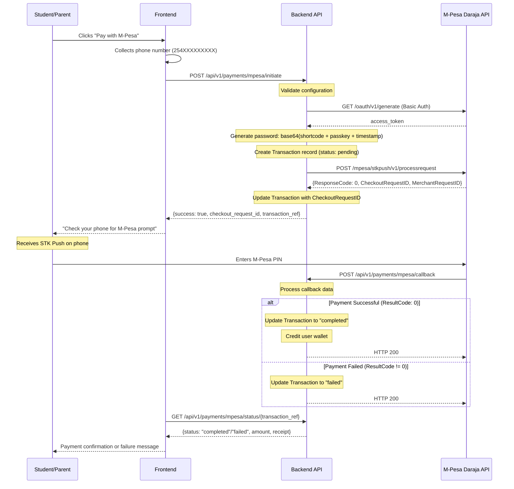

# M-Pesa Integration

> **Source files**: `backend/app/services/payment_service.py`, `backend/app/services/parent/mpesa_service.py`, `backend/app/api/v1/parent/mpesa.py`
> **Last updated**: 2026-02-15

## Overview

Urban Home School integrates with Safaricom's M-Pesa mobile money platform via the Daraja API for processing payments in Kenya. M-Pesa is the primary payment method for the platform, given that over 90% of Kenyan adults use M-Pesa for financial transactions.

The integration uses the **STK Push** (Lipa Na M-Pesa Online) flow, which initiates a payment prompt directly on the customer's phone.

---

## Payment Flow

### Sequence Diagram



---

## Configuration

All M-Pesa settings are defined in `backend/app/config.py`:

| Setting | Environment Variable | Description | Default |
|---|---|---|---|
| `mpesa_consumer_key` | `MPESA_CONSUMER_KEY` | Daraja API consumer key | `None` |
| `mpesa_consumer_secret` | `MPESA_CONSUMER_SECRET` | Daraja API consumer secret | `None` |
| `mpesa_shortcode` | `MPESA_SHORTCODE` | Business shortcode (Paybill/Till) | `None` |
| `mpesa_passkey` | `MPESA_PASSKEY` | Lipa Na M-Pesa passkey | `None` |
| `mpesa_environment` | `MPESA_ENVIRONMENT` | `sandbox` or `production` | `sandbox` |
| `mpesa_callback_url` | `MPESA_CALLBACK_URL` | Public URL for payment notifications | `None` |
| `mpesa_timeout_url` | `MPESA_TIMEOUT_URL` | URL for timeout notifications | `None` |

### API Base URLs

| Environment | Base URL |
|---|---|
| `sandbox` | `https://sandbox.safaricom.co.ke` |
| `production` | `https://api.safaricom.co.ke` |

The base URL is derived automatically from `mpesa_environment` via the `mpesa_base_url` property in `Settings`.

---

## OAuth Token Acquisition

Before any API call, an OAuth access token must be obtained:

```python
async def _get_mpesa_access_token(self) -> Optional[str]:
    auth_string = f"{consumer_key}:{consumer_secret}"
    auth_base64 = base64.b64encode(auth_string.encode('ascii')).decode('ascii')

    url = f"{base_url}/oauth/v1/generate?grant_type=client_credentials"
    headers = {"Authorization": f"Basic {auth_base64}"}

    response = requests.get(url, headers=headers, timeout=30)
    return response.json().get('access_token')
```

- Uses HTTP Basic Authentication with consumer key and secret
- Token is obtained fresh for each payment request (not cached)
- 30-second request timeout

---

## STK Push Request

### Password Generation

The M-Pesa API requires a password derived from:

```
password = base64(shortcode + passkey + timestamp)
```

Where `timestamp` is in `YYYYMMDDHHmmss` format.

### Request Payload

```json
{
    "BusinessShortCode": "174379",
    "Password": "<base64_encoded_password>",
    "Timestamp": "20260215103000",
    "TransactionType": "CustomerPayBillOnline",
    "Amount": 2500,
    "PartyA": "254712345678",
    "PartyB": "174379",
    "PhoneNumber": "254712345678",
    "CallBackURL": "https://yourdomain.com/api/v1/payments/mpesa/callback",
    "AccountReference": "TUHS-A1B2C3D4E5F6",
    "TransactionDesc": "Course Payment"
}
```

### Response

On success (`ResponseCode: 0`):
```json
{
    "MerchantRequestID": "12345-67890-12345",
    "CheckoutRequestID": "ws_CO_123456789",
    "ResponseCode": "0",
    "ResponseDescription": "Success. Request accepted for processing",
    "CustomerMessage": "Success. Request accepted for processing"
}
```

---

## Callback Handling

When the user completes (or cancels) the payment on their phone, M-Pesa sends a callback to the configured `CallBackURL`.

### Callback Data Structure

```json
{
    "Body": {
        "stkCallback": {
            "MerchantRequestID": "12345-67890-12345",
            "CheckoutRequestID": "ws_CO_123456789",
            "ResultCode": 0,
            "ResultDesc": "The service request is processed successfully.",
            "CallbackMetadata": {
                "Item": [
                    {"Name": "Amount", "Value": 2500.0},
                    {"Name": "MpesaReceiptNumber", "Value": "QLR123ABC456"},
                    {"Name": "TransactionDate", "Value": 20260215103045},
                    {"Name": "PhoneNumber", "Value": 254712345678}
                ]
            }
        }
    }
}
```

### Processing Logic

1. Extract `CheckoutRequestID` and `ResultCode` from callback data
2. Find the matching `Transaction` record by `CheckoutRequestID`
3. If `ResultCode == 0` (success):
   - Update transaction status to `completed`
   - Set `completed_at` timestamp
   - Extract callback metadata (amount, receipt number, phone)
   - Credit the user's wallet via `add_funds()`
4. If `ResultCode != 0` (failure):
   - Update transaction status to `failed`
   - Record failure reason from `ResultDesc`
5. Store the full callback data in `gateway_response`
6. Commit changes to the database

### Common Result Codes

| Code | Description |
|---|---|
| `0` | Success |
| `1` | Insufficient balance |
| `1032` | Request cancelled by user |
| `1037` | Timeout: user did not respond |
| `2001` | Wrong PIN entered |

---

## Transaction Status Verification

The system can query M-Pesa for a transaction's status using the STK Push Query API:

```python
url = f"{base_url}/mpesa/stkpushquery/v1/query"
payload = {
    "BusinessShortCode": shortcode,
    "Password": password,
    "Timestamp": timestamp,
    "CheckoutRequestID": checkout_request_id
}
```

This is used when the callback has not been received or when the frontend polls for status.

---

## Error Handling and Retries

### Request Errors

- Network errors are caught and logged; a failure response is returned to the frontend
- HTTP errors from the M-Pesa API are caught via `response.raise_for_status()`
- All requests use a 30-second timeout

### Database Errors

- If the transaction record cannot be created, the database session is rolled back
- If the callback processing fails, the session is rolled back to prevent partial updates

### Idempotency

Each transaction has a unique `reference_number` (format: `TUHS-{random_hex}`). The callback handler looks up transactions by `CheckoutRequestID`, so duplicate callbacks are handled safely (the status update is idempotent).

---

## Testing with M-Pesa Sandbox

### Setup

1. Register at [https://developer.safaricom.co.ke](https://developer.safaricom.co.ke)
2. Create a sandbox app to get consumer key and secret
3. Use the sandbox shortcode (`174379`) and test passkey
4. Set `MPESA_ENVIRONMENT=sandbox` in your `.env`

### Test Phone Numbers

The sandbox provides test phone numbers that automatically approve STK Push requests. Common test number: `254708374149`.

### Sandbox Callback

In sandbox mode, M-Pesa will send callbacks to your `MPESA_CALLBACK_URL`. For local development, use a tunneling service like ngrok to expose your local server:

```bash
ngrok http 8000
# Use the ngrok URL as MPESA_CALLBACK_URL
```

### Sandbox Fallback

The `MpesaService` class in `parent/mpesa_service.py` includes fallback sandbox responses when API calls fail, allowing development to continue without active M-Pesa credentials.

---

## Database Schema

### Transaction Record

| Field | Value |
|---|---|
| `gateway` | `"mpesa"` |
| `transaction_id` | `CheckoutRequestID` from M-Pesa |
| `reference_number` | `TUHS-{random_hex}` (internal reference) |
| `currency` | `"KES"` |
| `phone_number` | Customer phone (254XXXXXXXXX format) |
| `status` | `pending` -> `completed` or `failed` |
| `payment_metadata` | JSONB with phone, timestamp, receipt number |
| `gateway_response` | JSONB with full M-Pesa API responses |
