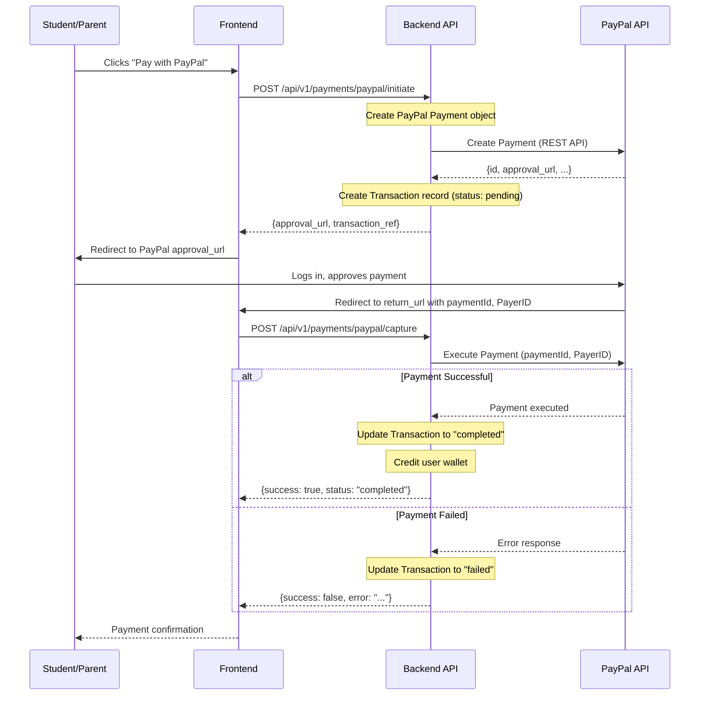

# PayPal Integration

> **Source file**: `backend/app/services/payment_service.py`
> **Last updated**: 2026-02-15

## Overview

Urban Home School integrates PayPal as an international payment option, primarily serving users outside Kenya or those who prefer card/PayPal wallet payments. The integration uses the PayPal REST API via the `paypalrestsdk` Python SDK.

---

## Payment Flow

### Sequence Diagram



---

## Configuration

| Setting | Environment Variable | Description | Default |
|---|---|---|---|
| `paypal_client_id` | `PAYPAL_CLIENT_ID` | PayPal REST API client ID | `None` |
| `paypal_client_secret` | `PAYPAL_CLIENT_SECRET` | PayPal REST API client secret | `None` |
| `paypal_mode` | `PAYPAL_MODE` | `sandbox` or `live` | `sandbox` |
| `paypal_webhook_id` | `PAYPAL_WEBHOOK_ID` | Webhook ID for event verification | `None` |

### API Base URLs

| Mode | Base URL |
|---|---|
| `sandbox` | `https://api-m.sandbox.paypal.com` |
| `live` | `https://api-m.paypal.com` |

### SDK Initialization

```python
from paypalrestsdk import Payment as PayPalPayment, configure as paypal_configure

if settings.paypal_client_id and settings.paypal_client_secret:
    paypal_configure({
        "mode": settings.paypal_mode,
        "client_id": settings.paypal_client_id,
        "client_secret": settings.paypal_client_secret
    })
```

---

## Creating a Payment

### Request

The `initiate_paypal_payment()` method creates a PayPal payment object:

```python
payment = PayPalPayment({
    "intent": "sale",
    "payer": {
        "payment_method": "paypal"
    },
    "redirect_urls": {
        "return_url": f"{base_url}/payment/execute",
        "cancel_url": f"{base_url}/payment/cancel"
    },
    "transactions": [{
        "item_list": {
            "items": [{
                "name": description,
                "sku": transaction_ref,
                "price": str(amount),
                "currency": currency,
                "quantity": 1
            }]
        },
        "amount": {
            "total": str(amount),
            "currency": currency
        },
        "description": description
    }]
})
```

### Response

On successful creation, the method returns:

```python
{
    "success": True,
    "data": {
        "payment_id": "<internal UUID>",
        "transaction_ref": "TUHS-PP-A1B2C3D4E5F6",
        "paypal_order_id": "<PayPal payment ID>",
        "approval_url": "https://www.sandbox.paypal.com/cgi-bin/webscr?cmd=...",
        "amount": 25.00,
        "currency": "USD"
    },
    "error": ""
}
```

The frontend redirects the user to the `approval_url` for PayPal login and payment approval.

---

## Capturing a Payment

After the user approves the payment on PayPal, the `capture_paypal_payment()` method executes it:

```python
paypal_payment = PayPalPayment.find(order_id)
paypal_payment.execute({"payer_id": paypal_payment.payer.payer_info.payer_id})
```

On success:
1. Transaction status is updated to `completed`
2. `completed_at` timestamp is set
3. User wallet is credited via `add_funds()`
4. Full PayPal response is stored in `gateway_response`

---

## Webhook Handling

The `handle_paypal_webhook()` method processes PayPal webhook notifications:

### Supported Event Types

| Event Type | Action |
|---|---|
| `PAYMENT.SALE.COMPLETED` | Mark transaction as completed, credit wallet |
| `PAYMENT.SALE.REFUNDED` | Mark transaction as refunded |

### Processing Logic

1. Extract `event_type` and `resource` from webhook data
2. Find the matching transaction by `parent_payment` ID
3. Update transaction status accordingly
4. For completions: credit the user's wallet
5. For refunds: mark the transaction as refunded

---

## Refund Processing

PayPal refunds are handled via webhooks. When a `PAYMENT.SALE.REFUNDED` event is received:

1. The transaction is located by its PayPal payment ID
2. The status is updated to `refunded`
3. The webhook data is appended to `gateway_response`

Manual refund initiation via the PayPal dashboard will trigger this webhook automatically.

---

## Database Schema

### Transaction Record

| Field | Value |
|---|---|
| `gateway` | `"paypal"` |
| `transaction_id` | PayPal payment ID |
| `reference_number` | `TUHS-PP-{random_hex}` |
| `currency` | User-selected (default: `"USD"`) |
| `status` | `pending` -> `completed`, `failed`, or `refunded` |
| `payment_metadata` | JSONB with `paypal_id`, `created_time` |
| `gateway_response` | JSONB with full PayPal API responses |

---

## Error Handling

- PayPal SDK errors are caught and returned as `{success: false, error: "PayPal error: ..."}``
- Database rollbacks are performed on any exception during transaction creation
- The `payment.error` attribute from the PayPal SDK is logged and returned to the caller

---

## Testing with Sandbox

1. Create a PayPal developer account at [https://developer.paypal.com](https://developer.paypal.com)
2. Create a sandbox app to get client ID and secret
3. Set `PAYPAL_MODE=sandbox` in your `.env`
4. Use sandbox buyer accounts for testing
5. Webhook events can be simulated via the PayPal developer dashboard
