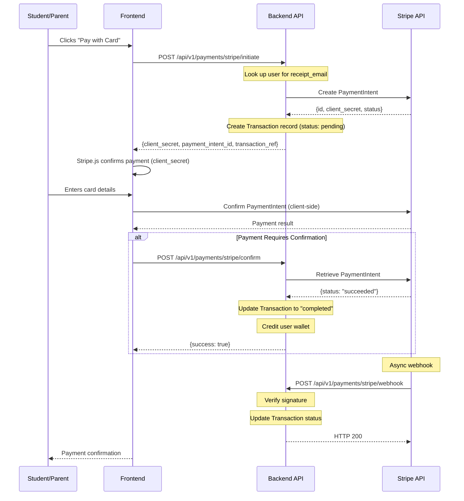

# Stripe Integration

> **Source file**: `backend/app/services/payment_service.py`
> **Last updated**: 2026-02-15

## Overview

Urban Home School integrates Stripe for card-based payments, providing a modern payment experience for users who prefer credit/debit cards. The integration uses Stripe Payment Intents for secure, SCA-compliant payment processing.

---

## Payment Flow

### Sequence Diagram



---

## Configuration

| Setting | Environment Variable | Description | Default |
|---|---|---|---|
| `stripe_secret_key` | `STRIPE_SECRET_KEY` | Stripe secret API key | `None` |
| `stripe_publishable_key` | `STRIPE_PUBLISHABLE_KEY` | Stripe publishable key (for frontend) | `None` |
| `stripe_webhook_secret` | `STRIPE_WEBHOOK_SECRET` | Webhook signing secret | `None` |
| `stripe_currency` | `STRIPE_CURRENCY` | Default currency | `kes` |

### SDK Initialization

```python
import stripe

if settings.stripe_secret_key:
    stripe.api_key = settings.stripe_secret_key
```

---

## Creating a Payment Intent

The `initiate_stripe_payment()` method creates a Stripe Payment Intent:

```python
payment_intent = stripe.PaymentIntent.create(
    amount=amount_cents,          # Amount in smallest currency unit (cents)
    currency=currency,             # e.g., "kes" (Kenyan Shilling)
    description=description,
    metadata={
        "transaction_ref": transaction_ref,
        "user_id": str(user_id),
        "course_id": str(course_id) if course_id else None
    },
    receipt_email=user.email,     # Auto-send receipt
    payment_method=payment_method_id,  # Optional
    confirm=True if payment_method_id else False
)
```

### Amount Conversion

Stripe requires amounts in the smallest currency unit. The service converts:
```python
amount_cents = int(amount * 100)  # e.g., KES 2500 -> 250000
```

### Response

```python
{
    "success": True,
    "data": {
        "payment_id": "<internal UUID>",
        "transaction_ref": "TUHS-ST-A1B2C3D4E5F6",
        "payment_intent_id": "pi_...",
        "client_secret": "pi_..._secret_...",
        "amount": 2500.0,
        "currency": "kes"
    },
    "error": ""
}
```

The `client_secret` is passed to the frontend for client-side payment confirmation using Stripe.js.

---

## Confirming a Payment

The `confirm_stripe_payment()` method verifies the payment status:

```python
payment_intent = stripe.PaymentIntent.retrieve(payment_intent_id)

if payment_intent.status == 'succeeded':
    # Update transaction to completed
    # Credit user wallet
elif payment_intent.status == 'requires_payment_method':
    # Mark as failed
else:
    # Still processing
```

### Payment Intent Statuses

| Status | Meaning | Action |
|---|---|---|
| `succeeded` | Payment complete | Mark completed, credit wallet |
| `requires_payment_method` | Payment failed | Mark failed |
| `requires_confirmation` | Needs server-side confirmation | Confirm |
| `requires_action` | Needs customer action (e.g., 3D Secure) | Wait |
| `processing` | Still processing | Wait |
| `canceled` | Payment canceled | Mark failed |

---

## Webhook Event Handling

The `handle_stripe_webhook()` method processes asynchronous Stripe events:

### Signature Verification

```python
event = stripe.Webhook.construct_event(
    json.dumps(webhook_data),
    signature,                    # Stripe-Signature header
    settings.stripe_webhook_secret
)
```

If signature verification fails, a `SignatureVerificationError` is raised and the webhook is rejected.

### Supported Event Types

| Event Type | Action |
|---|---|
| `payment_intent.succeeded` | Mark transaction as completed, credit wallet |
| `payment_intent.payment_failed` | Mark transaction as failed, record error |
| `charge.refunded` | Mark transaction as refunded |

### Processing Logic

For `payment_intent.succeeded`:
1. Find transaction by `payment_intent_id`
2. If not already completed, update status to `completed`
3. Set `completed_at` timestamp
4. Credit user wallet via `add_funds()`
5. Store event data in `gateway_response`

For `payment_intent.payment_failed`:
1. Find transaction by `payment_intent_id`
2. Update status to `failed`
3. Record failure reason from `last_payment_error.message`

For `charge.refunded`:
1. Find transaction by associated `payment_intent` ID
2. Update status to `refunded`
3. Store refund data in `gateway_response`

---

## Refund Processing

Stripe refunds are processed via webhooks when initiated from the Stripe dashboard. The `charge.refunded` event triggers:

1. Transaction lookup by `payment_intent_id`
2. Status update to `refunded`
3. Full refund event data stored in `gateway_response`

Programmatic refund initiation (e.g., from admin dashboard) can be added using:
```python
refund = stripe.Refund.create(payment_intent=payment_intent_id)
```

---

## Database Schema

### Transaction Record

| Field | Value |
|---|---|
| `gateway` | `"stripe"` |
| `transaction_id` | Stripe PaymentIntent ID (`pi_...`) |
| `reference_number` | `TUHS-ST-{random_hex}` |
| `currency` | `settings.stripe_currency` (default: `"KES"`) |
| `status` | `pending` -> `completed`, `failed`, or `refunded` |
| `payment_metadata` | JSONB with `payment_intent_id`, `client_secret` |
| `gateway_response` | JSONB with full Stripe API responses |

---

## Error Handling

### Stripe API Errors

```python
except stripe.error.StripeError as e:
    logger.error(f"Stripe API error: {str(e)}")
    return {"success": False, "data": {}, "error": f"Stripe error: {str(e)}"}
```

Common Stripe errors:
- `CardError`: Card declined or invalid
- `RateLimitError`: Too many requests
- `InvalidRequestError`: Invalid parameters
- `AuthenticationError`: Invalid API key
- `APIConnectionError`: Network issues

### Webhook Signature Errors

```python
except stripe.error.SignatureVerificationError as e:
    logger.error(f"Stripe webhook signature verification failed: {str(e)}")
    return {"success": False, "data": {}, "error": "Invalid signature"}
```

---

## Testing with Stripe Test Mode

1. Sign up at [https://stripe.com](https://stripe.com)
2. Use test mode API keys (prefix: `sk_test_`, `pk_test_`)
3. Set `STRIPE_SECRET_KEY` and `STRIPE_PUBLISHABLE_KEY` to test keys

### Test Card Numbers

| Number | Scenario |
|---|---|
| `4242424242424242` | Succeeds |
| `4000000000000002` | Declines |
| `4000002500003155` | Requires 3D Secure |
| `4000000000009995` | Insufficient funds |

### Webhook Testing

Use the Stripe CLI for local webhook testing:
```bash
stripe listen --forward-to localhost:8000/api/v1/payments/stripe/webhook
# Use the webhook signing secret from the CLI output
```
