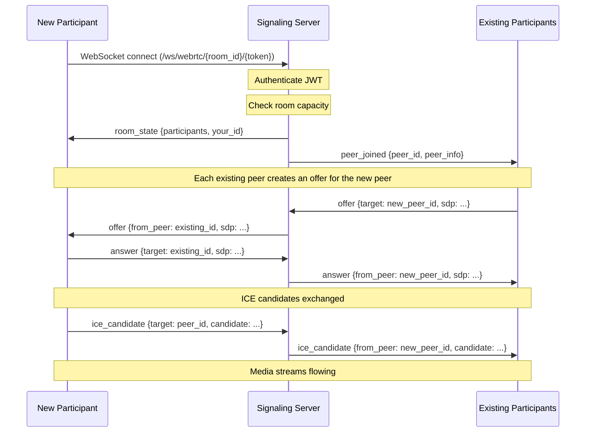

# WebRTC Live Sessions

> **Source file**: `backend/app/websocket/webrtc_signaling.py`
> **Last updated**: 2026-02-15

## Overview

Urban Home School supports live video/audio sessions for instructor-led classes and staff meetings using WebRTC peer-to-peer connections. The backend provides a signaling server that coordinates peer connection setup without relaying actual media streams.

---

## Architecture

### Signaling Server

The WebRTC signaling server operates over WebSocket connections, coordinating the SDP offer/answer exchange and ICE candidate relay between peers.

```
WebRTCSignalingManager
  |
  +-- rooms: Dict[room_id, WebRTCRoom]
  |     |
  |     +-- room_id: str
  |     +-- max_participants: int (default: 6)
  |     +-- participants: Dict[user_id, WebSocket]
  |     +-- participant_info: Dict[user_id, dict]
  |     +-- created_at: datetime
  |
  +-- get_or_create_room(room_id)
  +-- join_room(room_id, user_id, ws, user_info)
  +-- leave_room(room_id, user_id)
  +-- relay_signal(room_id, from_user, to_user, signal_data)
  +-- handle_message(room_id, user_id, raw_message)
```

### WebSocket Endpoint

```
/ws/webrtc/{room_id}/{token}
```

- `room_id`: Unique identifier for the live session room
- `token`: JWT access token for authentication

### Topology

The system uses a **mesh topology** where each participant connects directly to every other participant. This approach:
- Eliminates the need for a media server
- Provides lowest latency for small groups
- Is limited by the `max_participants` setting (default: 6) due to bandwidth and CPU constraints

---

## STUN/TURN Configuration

### Settings

| Setting | Environment Variable | Description | Default |
|---|---|---|---|
| `webrtc_stun_urls` | `WEBRTC_STUN_URLS` | STUN server URLs for ICE | `["stun:stun.l.google.com:19302", "stun:stun1.l.google.com:19302"]` |
| `webrtc_turn_url` | `WEBRTC_TURN_URL` | TURN server URL for NAT traversal | `""` (empty) |
| `webrtc_turn_username` | `WEBRTC_TURN_USERNAME` | TURN server username | `""` |
| `webrtc_turn_credential` | `WEBRTC_TURN_CREDENTIAL` | TURN server credential | `""` |
| `webrtc_max_participants` | `WEBRTC_MAX_PARTICIPANTS` | Max peers per room | `6` |

### ICE Configuration

The frontend uses these settings to configure RTCPeerConnection:

```javascript
const iceConfig = {
    iceServers: [
        { urls: ["stun:stun.l.google.com:19302", "stun:stun1.l.google.com:19302"] },
        {
            urls: "turn:turn.example.com:3478",
            username: "turn_user",
            credential: "turn_credential"
        }
    ]
};
```

### When TURN is Required

TURN servers are needed when peers are behind symmetric NATs or restrictive firewalls that prevent direct peer-to-peer connections. For a Kenyan deployment, TURN is strongly recommended since many users connect via mobile networks with carrier-grade NAT.

---

## Participant Limit

The default maximum is 6 participants per room. This limit exists because:

1. **Mesh topology**: Each participant sends media to every other participant. With N participants, each client maintains N-1 connections.
2. **Bandwidth**: At 6 participants, each client needs to send 5 streams and receive 5 streams.
3. **CPU**: Encoding/decoding 5 simultaneous video streams is demanding on mobile devices.

For larger sessions, LiveKit integration is used (see below).

---

## Peer Connection Lifecycle

### 1. Joining a Room



### 2. Signaling Messages

| Message Type | Direction | Target | Description |
|---|---|---|---|
| `offer` | Client -> Server -> Client | Specific peer | SDP offer for peer connection |
| `answer` | Client -> Server -> Client | Specific peer | SDP answer for peer connection |
| `ice_candidate` | Client -> Server -> Client | Specific peer | ICE candidate for connectivity |
| `media_state` | Client -> Server -> Room | All peers | Mute/unmute, camera on/off, screen sharing |
| `chat` | Client -> Server -> Room | All peers | In-session text chat |
| `ping` | Client -> Server | Self | Keep-alive ping |
| `pong` | Server -> Client | Self | Keep-alive response |

### 3. Media State Changes

Participants can broadcast media state changes (mute, camera toggle, screen sharing):

```json
{
    "type": "media_state",
    "peer_id": "user_123",
    "video": true,
    "audio": false,
    "screen_sharing": true
}
```

### 4. In-Session Chat

Text messages can be sent within the session:

```json
{
    "type": "chat",
    "from_peer": "user_123",
    "from_name": "John",
    "content": "Can everyone see my screen?",
    "timestamp": "2026-02-15T10:30:00.000Z"
}
```

### 5. Leaving a Room

When a participant disconnects (or their WebSocket closes):

1. The participant is removed from the room
2. All remaining participants receive a `peer_left` event
3. If the room is empty, it is deleted from memory

```json
{
    "type": "peer_left",
    "peer_id": "user_123",
    "participants": [...]
}
```

---

## Reconnection Handling

If a user reconnects to a room they are already in, the old WebSocket connection is closed and replaced:

```python
if user_id in room.participants:
    try:
        await room.participants[user_id].close()
    except Exception:
        pass
```

The new connection receives the current room state, and other participants are notified of the reconnection.

---

## LiveKit Integration

For staff live sessions that may require more participants or advanced features, the system integrates with LiveKit, a WebRTC SFU (Selective Forwarding Unit).

### Configuration

| Setting | Environment Variable | Description | Default |
|---|---|---|---|
| `livekit_url` | `LIVEKIT_URL` | LiveKit server URL | `http://localhost:7880` |
| `livekit_api_key` | `LIVEKIT_API_KEY` | LiveKit API key | `devkey` |
| `livekit_api_secret` | `LIVEKIT_API_SECRET` | LiveKit API secret | `secret` |

### Docker Service

LiveKit runs as a Docker container in the full stack:

```yaml
livekit:
    image: livekit/livekit-server:latest
    container_name: tuhs_livekit
    ports:
      - "7880:7880"   # HTTP API
      - "7881:7881"   # WebSocket
      - "7882:7882/udp"  # WebRTC media
    volumes:
      - ./livekit-config.yaml:/etc/livekit.yaml
    command: ["--config", "/etc/livekit.yaml"]
```

### When to Use LiveKit vs. Native WebRTC

| Feature | Native WebRTC | LiveKit |
|---|---|---|
| Max participants | 6 (mesh) | 100+ (SFU) |
| Server infrastructure | Signaling only | Media server required |
| Recording | Not supported | Built-in |
| Screen sharing | Basic | Advanced |
| Bandwidth usage | High (mesh) | Optimized (SFU) |
| Best for | Small instructor sessions | All-hands meetings, webinars |

---

## Singleton Instance

```python
webrtc_signaling_manager = WebRTCSignalingManager()
```

The signaling manager is a module-level singleton shared across the application.
