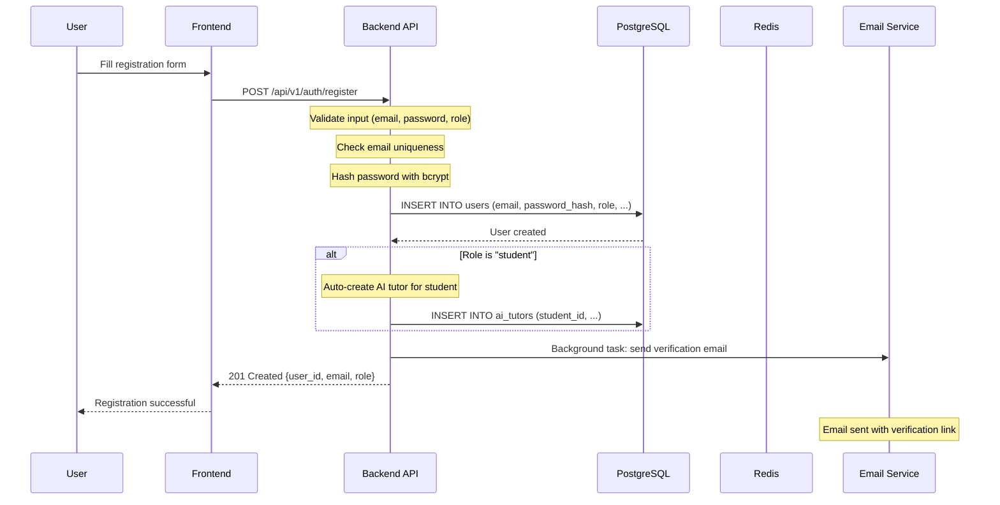
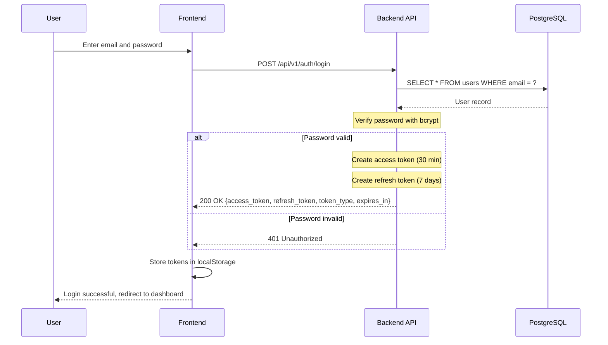
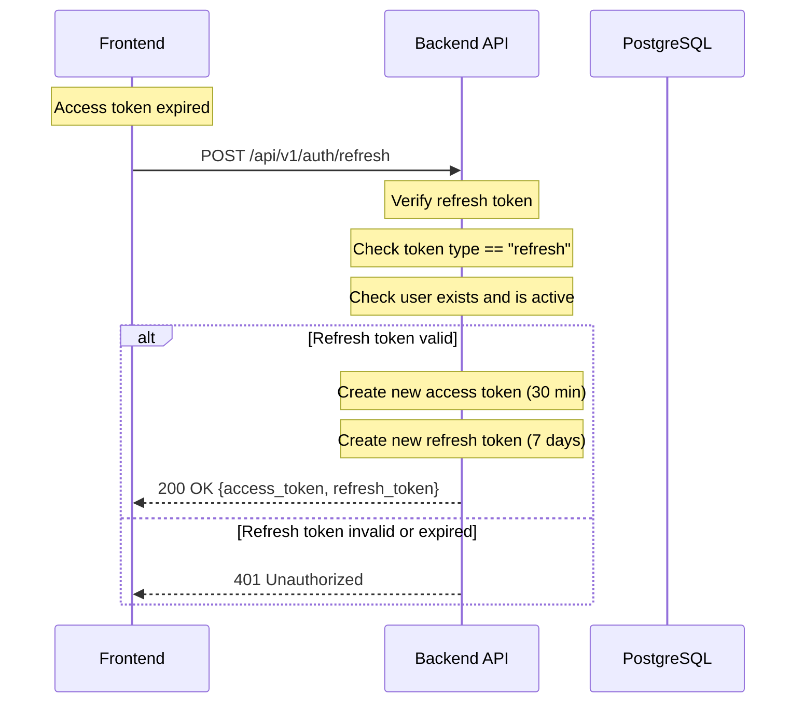
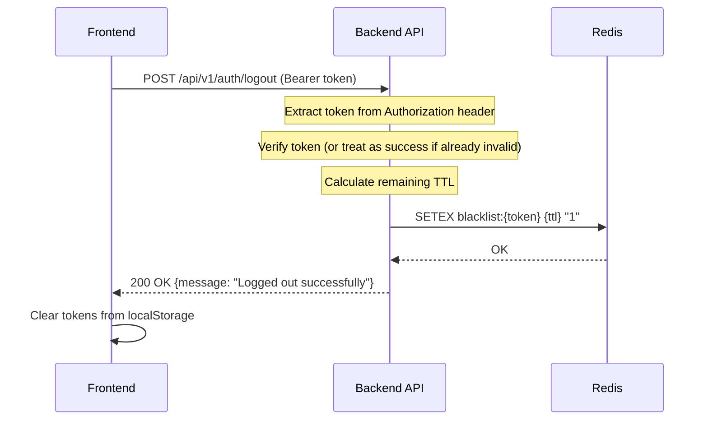
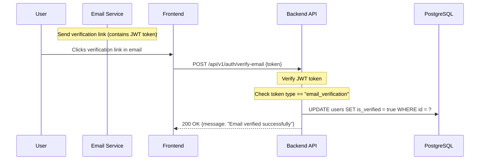
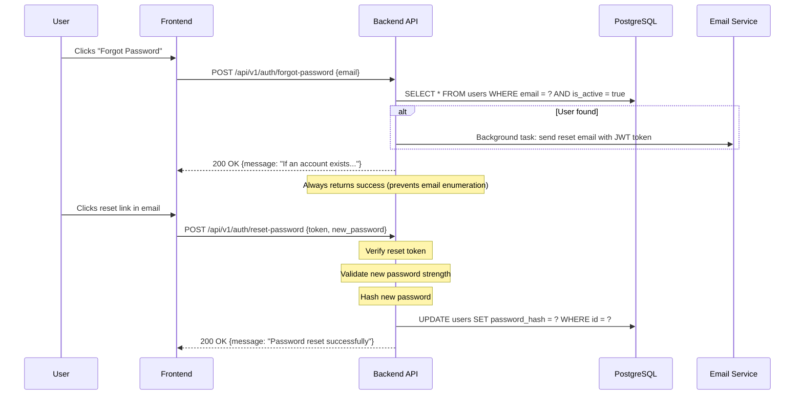

# Authentication Flow

> **Source files**: `backend/app/api/v1/auth.py`, `backend/app/utils/security.py`, `backend/app/services/auth_service.py`
> **Last updated**: 2026-02-15

## Overview

Urban Home School uses JWT (JSON Web Token) authentication with bcrypt password hashing. The system supports user registration, login, token refresh, logout (token blacklisting via Redis), email verification, and password reset.

---

## Registration

### Flow



### Endpoint

```
POST /api/v1/auth/register
```

### Request Body (UserCreate schema)

```json
{
    "email": "student@example.com",
    "password": "MyP@ssw0rd!",
    "role": "student",
    "full_name": "John Doe",
    "phone": "+254712345678"
}
```

### Password Requirements

- Minimum 8 characters (`password_min_length`)
- At least one uppercase letter (`password_require_uppercase`)
- At least one lowercase letter
- At least one digit (`password_require_numbers`)
- At least one special character (`password_require_special`)

### Password Hashing

```python
import bcrypt
hashed = bcrypt.hashpw(password.encode("utf-8"), bcrypt.gensalt()).decode("utf-8")
```

The system uses `bcrypt` directly (not via `passlib`) to avoid version incompatibility issues. The bcrypt salt is automatically generated and embedded in the hash.

### Verification Email

Sent as a background task via FastAPI `BackgroundTasks`:
```python
background_tasks.add_task(send_verification_email, user.email, str(user.id), user_name)
```

---

## Login

### Flow



### Endpoint

```
POST /api/v1/auth/login
```

### Request Body (UserLogin schema)

```json
{
    "email": "student@example.com",
    "password": "MyP@ssw0rd!"
}
```

### Response (TokenResponse schema)

```json
{
    "access_token": "eyJhbGciOiJIUzI1NiIs...",
    "refresh_token": "eyJhbGciOiJIUzI1NiIs...",
    "token_type": "bearer",
    "expires_in": 1800
}
```

### JWT Claims

#### Access Token Claims

| Claim | Description | Example |
|---|---|---|
| `sub` | User UUID | `"550e8400-e29b-41d4-a716-446655440000"` |
| `role` | User role | `"student"` |
| `email` | User email | `"student@example.com"` |
| `exp` | Expiration timestamp | `1708012200` |
| `iat` | Issued at timestamp | `1708010400` |
| `type` | Token type | `"access"` |

#### Refresh Token Claims

| Claim | Description |
|---|---|
| `sub` | User UUID |
| `exp` | Expiration (7 days from issuance) |
| `iat` | Issued at timestamp |
| `type` | `"refresh"` |

---

## Token Refresh

### Flow



### Endpoint

```
POST /api/v1/auth/refresh
```

### Request Body

```json
{
    "refresh_token": "eyJhbGciOiJIUzI1NiIs..."
}
```

---

## Logout

### Flow



### Token Blacklisting

Logged-out tokens are stored in Redis with a TTL equal to their remaining lifetime:

```python
exp = payload.get("exp", 0)
ttl = max(int(exp - time.time()), 1)
await redis.setex(f"blacklist:{token}", ttl, "1")
```

On every authenticated request, the system checks if the token is blacklisted:

```python
async def is_token_blacklisted(token: str) -> bool:
    return await redis.exists(f"blacklist:{token}") == 1
```

If Redis is unavailable, the system **fails open** (treats the token as not blacklisted) to avoid blocking all authenticated users.

---

## Email Verification

### Flow



### Endpoint

```
POST /api/v1/auth/verify-email
```

### Resend Verification

```
POST /api/v1/auth/resend-verification (requires authentication)
```

---

## Password Reset

### Flow



### Endpoints

```
POST /api/v1/auth/forgot-password    # Initiate reset
POST /api/v1/auth/reset-password     # Complete reset
```

### Security Measures

- **Email enumeration prevention**: The forgot-password endpoint always returns success, regardless of whether the email exists
- **Token expiration**: Reset tokens have a limited lifetime
- **Password validation**: New password must meet strength requirements

---

## Token Security Configuration

| Setting | Default | Description |
|---|---|---|
| `SECRET_KEY` | Required (min 32 chars) | JWT signing key |
| `ALGORITHM` | `HS256` | JWT signing algorithm |
| `ACCESS_TOKEN_EXPIRE_MINUTES` | `30` | Access token lifetime |
| `REFRESH_TOKEN_EXPIRE_DAYS` | `7` | Refresh token lifetime |

### Production Requirements

In production (`environment=production`):
- `SECRET_KEY` must be at least 64 characters
- `ENCRYPTION_KEY` must be at least 64 characters
- `SESSION_COOKIE_SECURE` must be `True`
- `DEBUG` must be `False`
